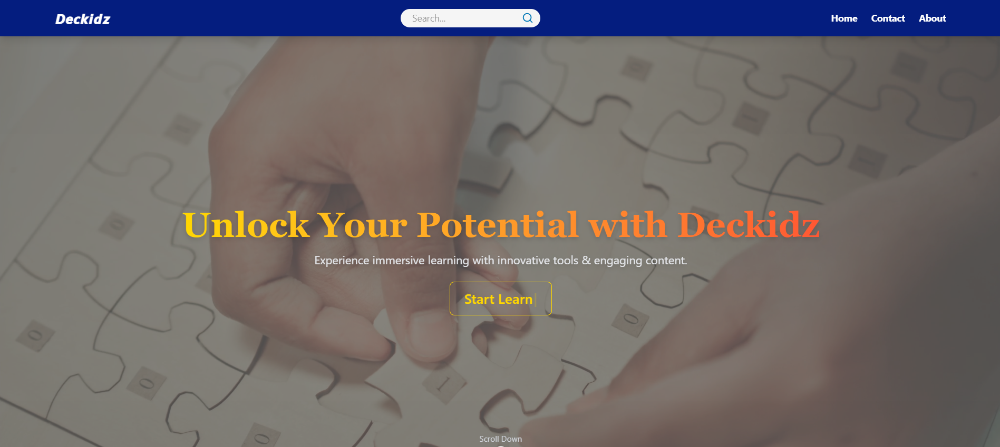
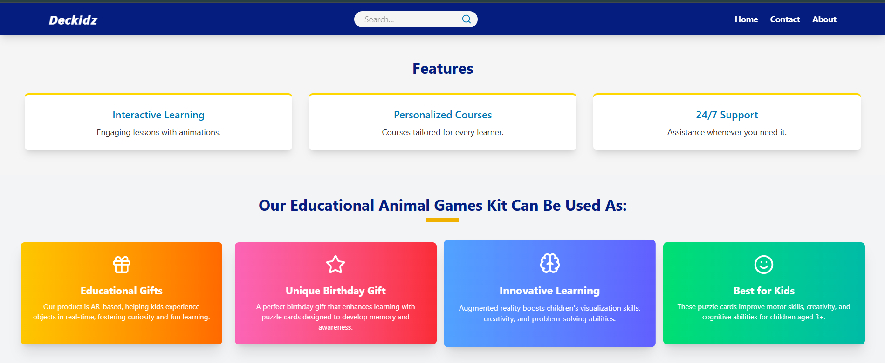
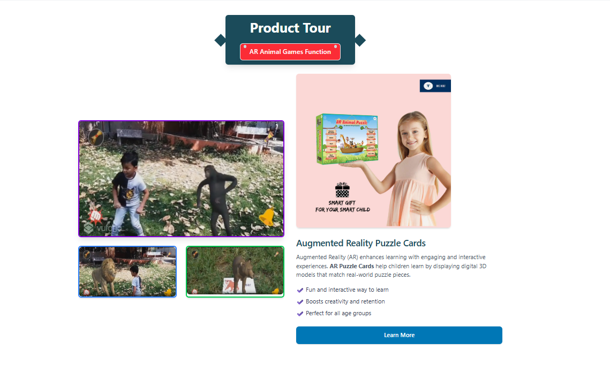
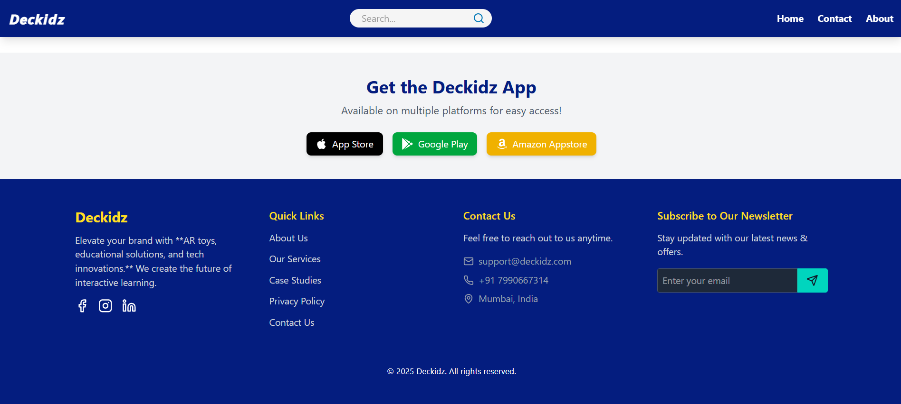
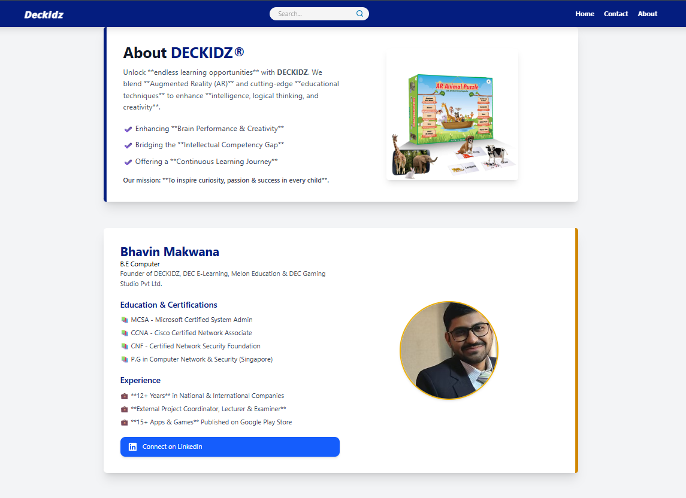
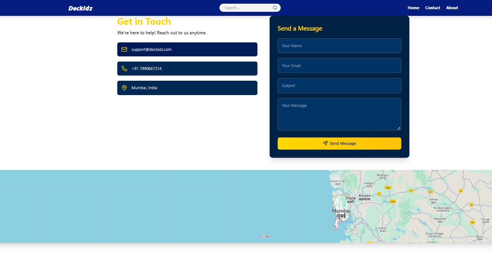

# Deckidz (Gaming-Studio-platform)

Welcome to the demo version of the **Deckidz** website — a frontend project built using **React.js** and **Tailwind CSS**. It is **not the official production version**, but rather a mockup to demonstrate layout, structure, and basic features.

🔧 **Purpose**:
- Trial development
- Frontend showcase
- Client feedback and revision

💡 I enjoyed working on this demo and exploring the design and user interface ideas. Feedback and suggestions are welcome!

> ⚠️ Note: This project is intended only for demonstration purposes and may not reflect the final functionality or content of the actual Deckidz website.

## Installation & Setup ##

#### 1. Clone the repository
git clone https://github.com/Kiranpokharkar2003/deckidz-demo.git
cd deckidz-demo

#### 2. Install dependencies
npm install

#### 3. Start the development server
npm run dev

## 📸 Screenshots

### 🏠 Home Page

### ℹ️ About Page

### ℹ️ Contact Page

💻 Thanks for visiting!  
This demo version of Deckidz was built with passion and care.  
Take a look around the codebase, run it locally, or drop a ⭐️ if you like the work!

